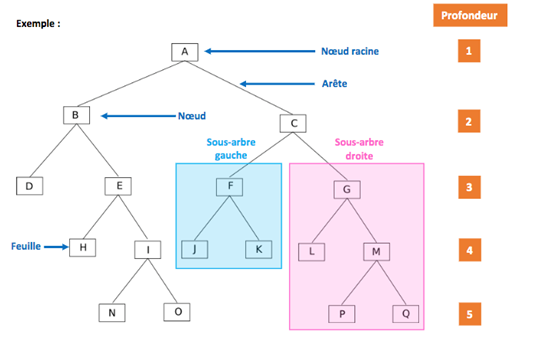
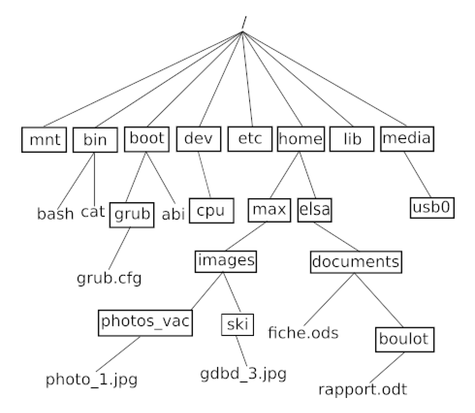
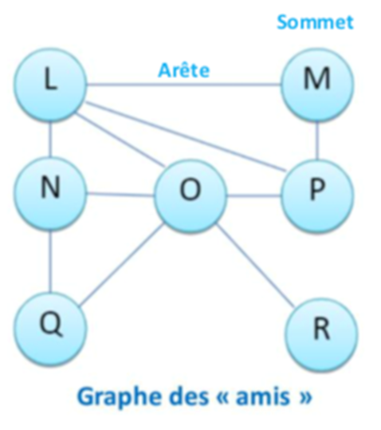

## Données Structurées, Partie 1

# Arbres, Graphes et Algorithme Dijkstra


## I. Arbres

 <!-- Largeur de l'image: 539px -->

*Figure 1 : Exemple d'un arbre de profondeur 5.*

### Noeud

Noeud racine = Noeud sans parent (unique dans l'arbre)  
Feuille = Noeud sans enfants  
Les noeuds sont reliés entre eux par des arêtes.

### Arbre
Taille = nombre de noeuds  
Profondeur = Distance à la racine  
Hauteur = Profondeur maximum de l'arbre
 
Note : La profondeur d'un arbre peut-être mesuré en partant de 0 ou (comme ci-dessus) de 1.

### Arbre binaire

Dans un arbre binaire, un noeud possède au plus 2 fils.  
On parle donc d'un sous-arbre gauche et d'un sous-arbre droit *(voir arbre ci-dessus)*.



*Figure 2 : Arborescence d'un système UNIX sous forme d'un arbre.*

Affirmation 1 : `grub.cfg` est dans le sous-arbre gauche de `boot` (en considérant boot comme la racine de l'arbre).  
Affirmation 2 : La **hauteur** de l'arbre est 5 (si la racine est à 0).   
Affirmation 3 : La **profondeur** de `max` est de 3 (si la racine est à 1).  
Affirmation 4 : `boot` est le noeud **père** de grub, qui est son **fils**.

---

## II. Graphes

Les graphes peuvent, par exemple, aider à se représenter :
- les relations de comptes dans des réseaux sociaux
- des zones géographiques à optimiser en logistique

### Vocabulaire

Un graphe est composé de sommets et d'arêtes (ou arc) les joignant.    
Un graphe est dit complet si toute paire de sommets est reliée par une arête.

Un graphe peut être : 
- orienté (fléché)
- pondéré (poids sur les arêtes)
- connexe (de n'importe quel point, on peut atteindre tous les autres)

Ordre = nombre de sommets d'un graphe  
Degré = nombre d'arêtes partant d'un sommet  
Sommets adjacents = reliés par une arête


Cycle = suite d'arêtes formant une boucle.  
Une chaîne eulérienne (ou graphe eulérien) est un graphe que l'on peut tracer sans lever le crayon.  


*Figure 3 : Exemple graphe eulérien*

Note : Si un chemin eulérien revient au sommet de départ, on parle de cycle eulérien ou circuit eulérien.

**Voir** **Théorème Eulérien** (sur [le cours](Activite-6_Arbres_et_Graphes/1-Arbres.pdf) ou [Wikipédia](https://fr.wikipedia.org/wiki/Graphe_eul%C3%A9rien))

### Exemple Réseaux sociaux



**Distance** = nombre d'arêtes minimum à traverser pour aller d'un sommet à un autre.  
*Exemple : Entre `L` et `R`, la distance est 2.*

**Ecartement** = distance maximum entre un sommet et les autres sommets du graphe.  
*Exemple : L'écartement du sommet `Q` est 3.* 

**Centre** = sommet d'écartement minimal.  
*Exemple : Les centres sont `L`, `N`, `O` et `P`.*

**Rayon** = écartement d'un centre.  
*Exemple : Le rayon est 2.*

**Diamètre** = distance maximale entre deux sommets du graphe.  
*Exemple : Le diamètre est 3, (entre `Q` et `M`).*

### Représentation


*Figure 3 : Exemple de graphe non orienté*

+ Écriture sous forme d'un dictionnaire
```Python
G = {A: [B, C, E], B: [A], C: [A], D: [E], E: [A, D]}
```

+ Graphe simple
```Python
# En français
G = (S, A) 
     |	|
     |	+-> Ensemble des arêtes
     +-> Ensemble des sommets

# Ou en anglais :
G = (V, E) # Vertice (also called nodes) and edge (also called links)

# Exemple :
V = {1,2,3,4,5,6}
E = {{1,2}, {1,5}, {2,3}, {2,5}, {3,4}, {4,5}, {4,6}}
```


---

CC0 - 2023
