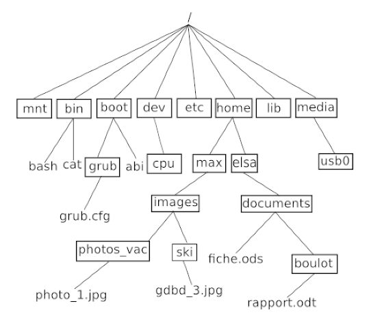
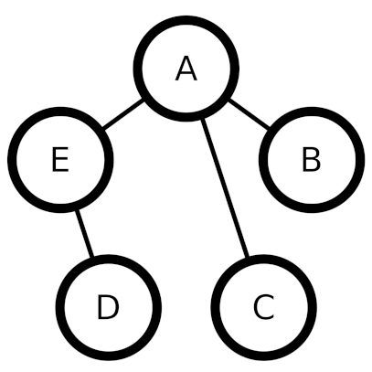

## Données Structurées, Partie 1

# Arbres, Graphes et Algorithme Dijkstra


## I. Arbres

 <!-- Largeur de l'image: 539px -->

*Figure 1 : Exemple d'un arbre de profondeur 5.*

### Noeud

Noeud racine = Noeud sans parent (unique dans l'arbre)  
Feuille = Noeud sans enfants  
Les noeuds sont reliés entre eux par des arêtes.

### Arbre
Taille = nombre de noeuds  
Profondeur = Distance à la racine  
Hauteur = Profondeur maximum de l'arbre
 
Note : La profondeur d'un arbre peut-être mesuré en partant de 0 ou (comme ci-dessus) de 1.

### Arbre binaire

Dans un arbre binaire, un noeud possède au plus 2 fils.  
On parle donc d'un sous-arbre gauche et d'un sous-arbre droit *(voir arbre ci-dessus)*.



*Figure 2 : Arborescence d'un système UNIX sous forme d'un arbre.*

Affirmation 1 : `grub.cfg` est dans le sous-arbre gauche de `boot` (en considérant boot comme la racine de l'arbre).  
Affirmation 2 : La **hauteur** de l'arbre est 5 (si la racine est à 0).   
Affirmation 3 : La **profondeur** de `max` est de 3 (si la racine est à 1).  
Affirmation 4 : `boot` est le noeud **père** de grub, qui est son **fils**.

---

## II. Graphes

Les graphes peuvent, par exemple, aider à se représenter :
- les relations de comptes dans des réseaux sociaux
- des zones géographiques à optimiser en logistique

### Vocabulaire

Un graphe est composé de sommets, d'arêtes (ou arc) les joignant.
  
Ordre = nombre de sommets d'un graphe  
Degré = nombre d'arêtes partant d'un sommet  
Sommets adjacents = reliés par une arête

Un graphe est dit complet si toute paire de sommets est reliée par une arête.

Un graphe peut être : 
- orienté (fléché)
- pondéré (poids sur les arêtes)
- connexe (de n'importe quel point, on peut atteindre tous les autres)

Un cycle est suite d'arêtes formant une boucle.  

Une chaîne eulérienne (ou graphe eulérien) est un graphe que l'on peut tracer sans lever le crayon.  
Un cycle eulérien (ou circuit eulérien) est une chaine eulérienne qui revient à son sommet de départ.

### Représentation



*Figure 3 : Exemple de graph non orienté*

Le graphe montré ci-dessus peut s'écrire :

```Python
G = {A: [B, C, E], B: [A], C: [A], D: [E], E: [A, D]}
```

<br>
🚧 In progress 🚧
<br><br>

---

CC0 - 2023
