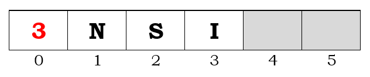
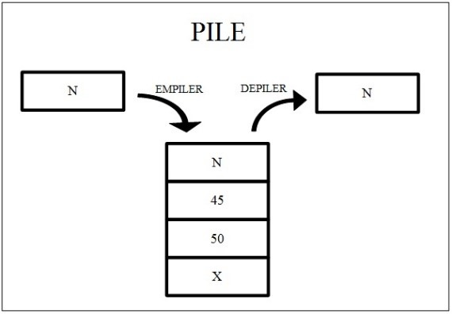
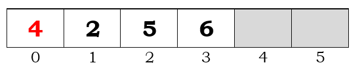
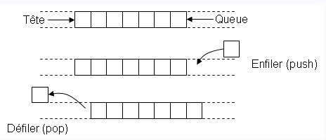
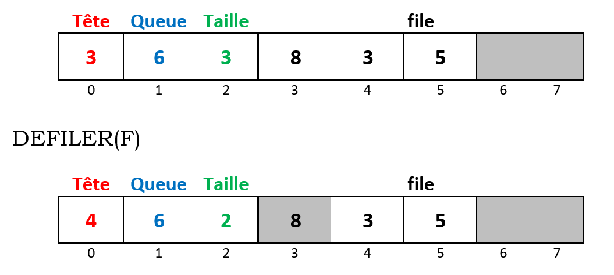

## Données Structurées, Partie 1

# Listes, Piles, Files et Dictionnaires


Dans ce chapitre nous avons travaillé sur les listes, les piles, les files et les dictionnaires ainsi que leur applications réelles.

## I. Notion d'interface

Interface -> Routines CRUD (Create, Read, Update, Delete) des structures de données.  
Ce sont des opérations fondamentales pour gérer des données.

---

## II. Liste

Séquentielle / linéaire

### Exemples :

```python
A = [3, 1, 4] 

# 3 est l'élément de tête.
# [1, 4] est la liste reste.


B = [] # Liste vide
```

Autre écriture possible (récursivité) :

```python
C = (3, (1, (4, [])))
```
### Représentation


*Figure 1 : Représentation sous forme d'un tableau. À noter que le compteur (3) correspond à l'indice du dernier élément de la liste.*

---

## III. Piles

Les piles sont en LIFO (Last In First Out).  
Un élément A entré après un élément B, sortira avant l'élément B

Les actions possibles : *Empiler* et *Dépiler*.



*Figure 2 : Opérations sur les piles*

### Représentation



*Figure 3 : Représentation sous forme d'un tableau. À noter que le compteur (4) est l'indice du premier emplacement libre.*

---

## IV. Files

Les piles sont en FIFO (First In First Out).  
Un élément A entré après un élément B, sortira après l'élément B

Exemple : *file* d'attente d'un guichet au cinéma  

La file a une tête (prochain élément qui sortira) et une queue (dernier élément entré dans la file)

Les actions possibles : *Enfiler* et *Défiler*.



*Figure 4 : Opérations sur les files*




*Figure 5 : Représentation sous forme d'un tableau. À noter que le compteur (4) est l'indice du premier emplacement libre.*

---

## V. Dictionnaires

On y associe des **valeurs** à des **clés**  
Les dictionnaires ne sont pas ordonnés (pas d'indices)  

On retrouve une valeur à partir de sa clé

```python
dict1 = {
    nom: 'Dupont avec un T',
    numero: '01 23 45 67 89',
}
```

---

CC0 - 2023