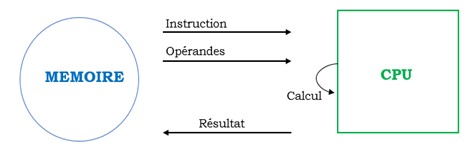

## Architecture matérielle et Système d'exploitation, Partie 1

# Architecture matérielle

## I. Architecture de base

Tout  programme  est  une  suite d’opérations simples  qui  ont  toutes  la  même forme.

*Figure 1 : Fonctionnement d'un programme*

**Famille de processeur**

- RISC (Reduced Instruction Set Computer), ils sont plus simples et plus rapides
- CISC (Complex Instruction Set Computer), ils sont plus complexes et plus lents

**Mémoire**
1. Permanente (Conservées quand la machine est éteinte)
2. Volatile
    - La mémoire vive ou RAM (Random Access Memory : mémoire à accès aléatoire)
    - La mémoire cache ou antémémoire (Cache Memory : stocke des données en cours d'utilisation)
    - Le registre est un emplacement de mémoire interne à un processeur. Les registres se situent au sommet de la hiérarchie mémoire : il s'agit de la mémoire la plus rapide d'un ordinateur, mais dont le coût de fabrication est le plus élevé, car la place dans un microprocesseur est limitée.

**SoC (System on a Chip)**

## II. Système d'exploitation

Un OS est un ensemble de programmes qui va permettre d’utiliser les éléments physiques d’un ordinateur pour exécuter les applications.

*Figure 2 : L'architecture d'un OS*

## III. Processus

Language de haut niveau (Celui qu'on écrit) -> Compilateur (transformation en language machine) -> Exécution

Processus = programme en cours d'exécution

**État d'un processus**

- Elu = en cours d'exécution
- Prêt = prêt à être exécuté / attend que le processeur soit libre
- Bloqué = attente d'une ressource

Transition entre les états :
- Prêt -> Elu = *election*
- Elu -> Bloqué = *blocage*

**Ordonnancement des processus**

Plusieurs algorithmes d'ordonnancement :

- FIFO (First In First Out) 
    + Si un processus se bloque, le processus suivant est élu
- SJF (Shortest Job First)
    + Inconvénient : si des processus courts arrivent en permandence, les processus longs ne seront jamais élu
- L'ordonnancement par priorité
    + Les processus sont classés par priorité
- RR (Round Robin) = L'algorithme du Tourniquet
    + Chaque processus est exécuté pendant un temps donné (quantum)
    + Si le processus n'est pas terminé, il est remis à la fin de la file d'attente

*Figure 3 : Algorithme du Tourniquet*

**PID et PPID**

- PID = Process ID
    + Croissant (Processus 1, Processus 2, Processus 3, ...)
- PPID = Parent Process ID

Note : Le processus 0 est le processus init, il n'a pas de parent.

*Figure 4 : Arborescence des processus*

## IV. Interblocage (Deadlock)

[Voir l'exemple à la fin du cours](Activite-1_Architectures_Materielles/Architectures_Materielles_et_Systemes_d_Exploitation.pdf)