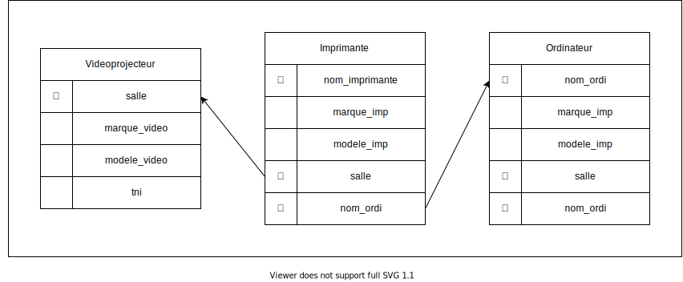

# Sujet d'entrainement: [Epreuve de Janvier 2022](epreuve_janvier_2022.pdf)

## Exercice 1

1. a. La commande `SELECT salle, marque_ordi FROM Ordinateur ;` renvoie le tableau suivant :

| salle | marque_ordi |
|-------|-------------|
|  012  |     HP      |
|  114  |   Lenovo    |
|  223  |    Dell     |
|  223  |    Dell     |
|  223  |    Dell     |

1. b. La commande `SELECT nom_ordi, salle FROM Ordinateur WHERE video = true ;` renvoie le tableau suivant :

| nom_ordi | salle |
|----------|-------|
|  Gen-24  |  012  |
| Tech-62  |  114  |
| Gen-132  |  223  |

2. la commande pour extraire toutes les données des ordinateurs dont la date est égale est supérieur à 2017 par ordre croissant est la suivante : 
```sql
SELECT * FROM Ordinateur WHERE anne >= 2017 0RDER BY annee
```

3. a. L'attribut salle ne peut pas être une clé primaine car elle n'est pas unique pour la relation `Ordinateur`

3. b. Voici le schema relationnel de Imprimante et les tables auquels elle est relié.



4. a. La commande pour ajouter un vidéo projecteur à la table `Videoprojecteur` est la suivante :
```sql
INSERT INTO (315, "NEC", "ME402X", true) Videoprojecteur
```

4. b. Voici la commande pour récupérer les attributs salle, nom_ordi et marque_video depuis les tables `Videoprojecteur` et `Ordinateur`
```sql
SELECT salle, nom_ordi, marque_video FROM Videoprojecteur JOIN Ordinateur USING (Salle)
```

## Exercice 2

1. Les SoC sont des puces optimisés pour répondre à un besoin, on en trouve de toutes puissance avec des capacités qui different. On peut imaginer que dans le cas de l'ABS, la puce utilisé doit répondre à des contraintes très précises et une fiabilité exemplaire pour la sécurité des occupants, elle n'a cependant pas besoin d'être très puissante car elle répond à un besoin très simple, détecter un frénage et empécher un blocage de roues. L'usage d'un ordinateur pour répondre à ce besoin pose des problématiques : tout d'abord une architecture classique tel qu'un ordinateur est démesurement excessif en puissance et en capacité par rapport à une puce SoC, il deborde de capactité non exploité. Il répondra au besoin mais au détriment d'une fiabilité et d'une consommation faible d'élétricit. En plus d'un coup plus élevé, un ordinateur prend bien plus de place par rapport à la centralisation qu'offre une puce életronique.

2. Ceci est une sitation d'interblocage, on peut le vérifier en déterminant un chemin oû un processus est bloqué car attend pour un fichier 